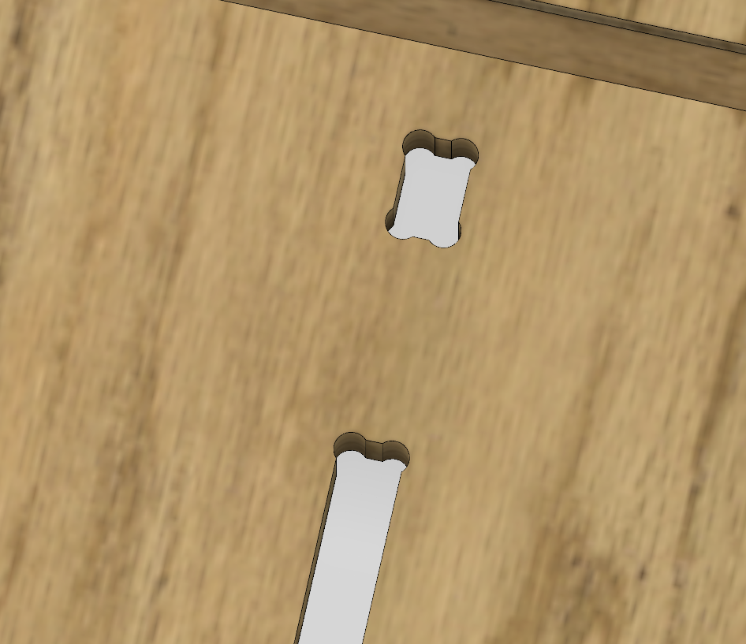

# Kit Production
## Kit Composition
In this section you will go through all the steps to supply and create your PlanktoScope kit.
You can find a list of the components needed in the [Planktoscope V2.6 BOM](../../../../assets/hardware/v2.6/Planktoscope V2.6 BOM.xlsx).

| Files                                                                               | Description                       |
|-------------------------------------------------------------------------------------|-----------------------------------|
| [Planktoscope V2.6 BOM](../../../../../../hardware/v2.6/Planktoscope_V2.6_BOM.xlsx) | Bill Of Material for PlanktoScope |

We tried to have the most easy-to-supply components, you still may have to adapt and research for new suppliers according to product availability and your location.
If you find some local alternative please share your custom BOM to our GitHub Discussions thread for [v2.6 Localized Hardware BOMs](https://github.com/PlanktoScope/PlanktoScope/discussions/502), so that other members of our community can learn from your work!

In the following sections we will go more in detail on:

- the possibility to machined on your own the [Mechanical Structure](#mechanical-structure)
- the documentations and assembly steps to manufacture the [PlanktoScope HAT V1.3](#planktoscope-hat-1.3-pcb)
- the cabling steps of the [LED Assy](#led-assembly), the [Alim Jack Assy](#alim-jack-assembly) and the [OnOff Button Assy](#onoff-button-assembly)
- And finaly the [Optic 20-200 Assy](#optic-20-200-assembly)

## Mechanical Structure

In order to create the PlanktoScope case, parts were designed to be machined with a CNC milling machine. 
The configuration of the CNC milling machine plays a crucial role in the machining process and can significantly affect the quality and efficiency of the production of a workpiece. You will have to adapt the file to your machine as every CNC milling machine gets its characteristics: feed rate and diameter adjustment according to your machine and selected end mill. 
And don't forget safety, use your nicest protective glasses! :-)

### Manufacturing file

Here you can find the .dxf file to create the program on a CNC milling machine. If you do not have the equipment and/or the knowledge do not hesitate to contact local suppliers and fablabs. 

>[!NOTE]
> Depending on stock availability, FairScope can also be considered as a supplier.
    

| Files                     | Description                              |
|---------------------------|------------------------------------------|
| PlanktoScope_CaseV2.6.dxf | PlanktoScope Case export for CNC Milling |

This .dxf file has been designed for a **thickness of the material at 7.6mm (3 inches)**. 

For a different thickness you’ll need to adapt it.

>[!TIP]
>For a better assembly and if your software does not add it automaticaly use "dog bone" filet on every corner. :bone:

#### Reference Plate

In order to calibrate correctly your CNC machine you'll find here the .dxf file and the expected dimensions of a reference plate. If your parameters allowed you to reach these dimensions, you can report the adaptation on the [PlanktoScope_CaseV2.6.dxf] and launch the milling with more insurance.

| Files           | Description                    |
|-----------------|--------------------------------|
| Plate_F_Ref.dxf | Plate F export for CNC milling |

Drawing with quotation

### Material
A great variety of material can be used to create the PlanktoScope case. You need to be sure that it can be machined easily and has great durability in harsh conditions. Here you can find 2 examples of used material: Bamboo Plywood & Valchromat.

1. Bamboo Plywood

Bamboo plywood is a renewable, eco-friendly material made from layers of bamboo strips pressed together. It is known for its strength, durability, and resistance to warping, making it ideal for furniture. Bamboo plywood is lightweight, versatile, and more sustainable than traditional hardwoods, as bamboo grows quickly and requires fewer resources to cultivate.
FairScope is using Bamboo Plywood for V2.6.

2. Valchromat

Valchromat is a wood-based composite material made from recycled wood fibers and colored with natural dyes. It is known for its durability, resistance to moisture and decay, and ability to be machined and finished in a similar way to solid wood.

### Finnish of the plates

After your wonderful milling process, remove all dust and remains of the milling and machining.

Here you can use your favorite finishing according to the selected material. Be sure that it remains as environmentally friendly as possible.

>[!NOTE]
> For example, FairScope uses Rubio Monocoat Plus. It is a wood finishing product that is designed to provide a durable, natural-looking finish to wood surfaces. It is made from plant-based oils and pigments, which give it a transparent finish that enhances the natural aspect of the wood.

Dry all parts and store them for the assembly process.

## PlanktoScope Hat 1.3 PCB

Welcome to the PCB production manual for the PlanktoScope Hat 1.3!

A **Printed Circuit Board (PCB)** is a vital component of electronic devices, providing physical support and electrical connections for components. The PCB production process involves three main stages:

1. Design: Engineers use software (e.g., Altium, KiCad) to create the schematic and layout, optimizing component placement, trace paths, and layers.

2. Fabrication: Copper and fiberglass sheets are processed via etching, plating, drilling, and layer stacking to form the circuit structure.

3. Assembly: Components are placed and soldered either manually or with automated systems.

Components used on PCBs are either **Thru-Hole** (leads pass through the board, ideal for durability) or **Surface Mount** (soldered directly on the surface, suited for compact designs). The choice depends on the device’s requirements.

You will find on the following files the full documentation to ask for a quotation to your electronic prototypist.
We will also guide you through the assembly of side components to complete the PlanktoScope HAT 1.3 fabrication.

>[!NOTE]
> Depending on stock availability, FairScope can also be considered as a supplier for the fully assembled PlanktoScope HAT 1.3.

### Manufacturing Information

#### Manufacturing Files

| Files                                                                                                                | Description                                                                                                                   |
|----------------------------------------------------------------------------------------------------------------------|-------------------------------------------------------------------------------------------------------------------------------|
| [Gerber files PlanktoScope HAT V1.3.zip](../../../../../../hardware/v2.6/Gerber_files_PlanktoScope_HAT_V1.3.zip)     | The exported Gerber files for PCB fabrication                                                                                 |
| [Assembly files PlanktoScope HAT V1.3.zip](../../../../../../hardware/v2.6/Assembly_files_PlanktoScope_HAT_V1.3.zip) | The SMD components list and assembly footprints, Pick-and-place machine instructions, Additional data for ThruHole components |

Some components are missing from the "Pick-and-Place machine instructions" file. Please refer to the document titled "PlanktoscopeHat-v1.3-fab\_thru-hole component (missing from PnP).jpg" for further details.

We recommend asking your prototypist to assemble all the thru-hole components. In order to reduce costs and if you feel like doing it, you can assemble them manually, be really cautious of the correct solderings.

The assembly of the Drivers TMC 5160 and the Axial Fan assembly are here proposed in parallel and DIY. No worries, everything is explain in [Assembly of the Drivers TMC 5160](#assembly-of-the-drivers-tmc-5160) & [Assembly of the Axial Fan](#assembly-of-the-axial-fan). 
They are not included in Thru-Hole components list for the prototypiste.

#### Configuration on prototypist website

The following configuration parameters can be used for the production of the PCB.

>[!CAUTION]
> Please note that the naming may vary depending on the manufacturing company you used and are only intended to provide you with support. You can, of course, adjust the parameters as you see fit.

##### Board dimensions

65 mm x 100 mm

##### Circuit specifications

| Property                               | Value      |
| -------------------------------------- | ---------- |
| Material                               | FR4        |
| Thickness                              | 1.6 mm     |
| Finish                                 | Chem. gold |
| Number of layers                       | 2          |
| Specific stackup                       | sans       |
| SMD sides                              | top        |
| Finished external copper thickness (µ) | 35 µm      |
| Internal copper thickness (µ)          | without    |
| IPC Class                              | Class 2    |

##### Solder mask

| Property      | Value     |
| ------------- | --------- |
| Solder mask   | TOP + BOT |
| Mask colour   | green     |
| Peelable mask | without   |

##### Marking

| Property         | Value     |
| ---------------- | --------- |
| Silkscreen (ink) | TOP + BOT |
| Ink colour       | white     |
| ROHS marking     | without   |
| UL marking       | without   |
| Date marking     | without   |

##### Specific options

| Property                   | Value     |
| -------------------------- | --------- |
| Space between tracks       | > 0.15 mm |
| Min. drill hole size       | > 0.20 mm |
| Blind via                  | with out  |
| Cross blind                | no        |
| Burried via                | na        |
| Impedance control          | no        |
| Edge plating               | no        |
| Press-fit                  | no        |
| Carbon                     | without   |
| Via Fill                   | without   |
| Beveled edge               | without   |
| Contersunk holes           | without   |
| Contersunk holes (qty/PCB) | without   |
| Metallographic section     | without   |
| Gold fingers (thickness)   | without   |
| Gold fingers (qty/PCB)     | without   |

You should receive a PCB looking similar to the following pictures:

#### Next steps
As explain earlier on and in order to let you dive into a fun DIY project or pick up a new skills, some soldering is about to come! In the following steps, we’ll guide you through assembling the Drivers TMC 5160 (used to control the peristaltic pump and the linear stepper motors) and the Axial Fan. Let’s get started!

### Assembly of the Drivers TMC 5160

#### Tooling :hammer_and_wrench:

- Professional Soldering Iron
- Solder
- Breadboard
- Utility knife
- Mutlimeter

>[!WARNING] 
> When you solder this for the first time, take special care to gather information and train yourself. Do not hesitate to have a look to this [Soldering 101: Beginners Guide](https://www.youtube.com/watch?v=rK38rpUy568).

#### Assembly Steps

1. Prepare the components

| Component                            | Example of reference | Qty |
|--------------------------------------|----------------------|-----|
| Driver TMC 5160 SilentStepStick      | 700-TMC5160SILENTSTE | 2   |
| Connector Header Vertical 2POS .54MM | 732-5315-ND          | 2   |

>[!NOTE]
> Usually 2 Connectors Header of 8 position comme alongside each Driver. If it is not the case you can also buy one with many position and cut it in order to gets 4*8 and 2*2 connectors.

Unpack the Drivers TMC 5160 and the Connector Header strips of 8 pins (x2) and 2 pins(x1), take the breadboard and warm your soldering iron.

2. Cut the via bridge

:hammer_and_wrench:
[Tooling](#tooling-hammerandwrench): 
- [ ] Utility knife
- [ ] Multimeter

Bridge Cut: use a razor blade or a utility knife to unable conductivity between 2 of the 4 slots as shown in the following visual:

Check if the two slots are correctly isolated from one another with a multimeter in conductivity mode.

>[!WARNING]
> This step not follow traditional methods, but be careful to cut this bridge only to keep the PCB integrity.

3.  Set in position the Connector Header strips

Plug the connectors with the appropriate distance to the breadboard.

photo connector sur une breadboard

The breadboard supports you during soldering to ensure the spacing and angle of the Connectors.

4.  Set in position the Drivers TMC 5160 PCB

Positioned the Drivers TMC 5160 PCB on the connectors set on the breadboard.

>[!WARNING]
> Make sure that the larger chip labeled "trimatik" is positioned on the bottom of the board and the four smaller chips are positioned on the top of the board as shown in the picture.

5.  Soldering

Now solder all pins of the connectors strip.

>[!TIP]
> You can also solder one pin on one side and then the opposite pin on the other side to secure your workpiece, ensuring it stays in place without shifting accidentally.

#### Finalisation & Installation

Re do the operation for the second Driver TMC 5160. 

Install it on your PlanktoScope Hat 1.3 on the designated connectors.

Photo montage driver sur HAT

### Assembly of the Axial Fan

These steps will show you how to install the axial fan on the PlanktoScope Hat 1.3 and how to create soldering bridges at the bottom of the board.

#### Tooling :hammer_and_wrench:

- Professional Soldering Iron
- Solder
- Classic Pliers
- Screwdriver Hex 2
- Wires Stripper pliers

#### Assembly Steps

1. Prepare the components

| Component                             | Example of reference | Qty |
|---------------------------------------|----------------------|-----|
| PlanktoScope HAT 1.3 PCB              |                      | 1   |
| Axial Fan RS PRO 5 V - 40 x 40 x 10mm | 789-7858             | 1   |
| Screw TBHC EMBASE M3X14 INOX A2       | TBHCEMB03/014A2      | 4   |
| Square nuts M3x5.5x1.8                | ECRCAR03/05/05A2     | 4   |

2. Install the Axial Fan

:hammer_and_wrench:
[Tooling](#tooling-hammerandwrench): 
- [ ] Wire stripper pliers
- [ ] Screwdriver Hex2
- [ ] Classic Pliers

Cut off the wires of the Axial Fan in order to leave about 6 cm.
Strip the wires on 5mm.

Install the fan with the four screws and nuts on the top side of the PlanktoScope HAT 1.3 PCB. 

Pay attention to the **running direction** with the arrow marking on the side of the Axial Fan. The Axial Fan should **blow on the cooler** of the Raspberry Pi (from Top to Bottom of the PlanktoScope HAT 1.3 PCB).
Engage the wire through the hole in the PlanktoScope HAT 1.3 PCB to reach the bottom of the board.

Screw the 4x **M3*14 Screw** with **Screwdriver Hex2** and **Classical pliers**.

3. Solder the wires

Tin the wires extremities. Solder the fan cables according to the marking and color codes ⚫ GND, 🔴 VCC.

4. Solder bridges

Create soldering bridges between:

- The 2 slots of J3

- The middle slot and +5V

    
- The middle slot and )D

  

### You have finished soldering and assembling the components!

Congratulation! You have finished to assemble the PlanktoScope HAT 1.3 PCB components, it should look like on the following pictures:

photo hat terminé

## Cabling Component
The next step of the kit preparation is to prepare some cabling: by using standard component with few simple cabling steps it become possible to get tailor maid component for the PlanktoScope.

In the following chapters we will go through soldering and crimping adventures.

For this the needed equipments will be:
#### Tooling :hammer_and_wrench:

- Professional Soldering Iron
- Solder
- Crimping pliers
- Stripping pliers
- Third Hand / small Anvil
- Heat Gun

You willl also need, in addition to the component themselves, some consumable:
#### Consumable:

- Heat Shrink Black \&Oslash
- Heat Shrink Red \&Oslash
- Wire Crimps
- Zip Ties

>[!NOTE]:
>You can find reference example in the "Consumable" section of the [Planktoscope V2.6 BOM](../../../../assets/hardware/v2.6/Planktoscope V2.6 BOM.xlsx).

### LED Assembly

A simple first assembly is the LED Assembly.

1. Prepare the components

| Designation                       | Qty | Example of reference  |
|-----------------------------------|-----|-----------------------|
| JST 1.25mm Male Connectors 200 mm | 1   | Ali Express - JST-200 |
| Super Bright White 5mm LED        | 1   | Mouser - 485-754      |

Here the JST connector proposed is already wired.

2. Prepare the wires. With the **stripping pliers** stripped the wire over 1cm.

3. Slide a black **heat shrink** on both of the wires. Slide an aditional and smaller red **Heat Shrink** on the red wire.

4. Find the anode (smaller) and cathode (longer) pin of the **LED**.

5. Maintain the LED or the wires with the **third hand**. Add some soldering material to both the wires extremities and to the pins of the LED.
   Solder the 🔴red wire to the cathode pin (longer pin) and the ⚫black wire to the anode (small pin)..

6. Slide the heat srink on the soldering and use the **heat gun** to secure it and make sure <ins>no contact can be made between the 2 pins</ins>.

7. Led Assembly is ready!

### Alim Jack Assembly

The Alim Jack Assembly will be the link between the external 12V adaptor to the internal electronic system.

1. Prepare the components
   
| Designation                          | Qty | Example of reference |
|--------------------------------------|-----|----------------------|
| DC Power Jack Shield - 5,5mm 2,1mm   | 1   | Ampul	AM1249         |
| Bullet Connector 3.5mm Male + Female | 1   | Amazon B081TXM3XN    |

2. Set 15mm of Black and Red Heat Shrink  resppectively on the Black and Red wires.

3. Maintain the **Female Bullet Connector** up on the **Small Anvil**, warm it with the **Solder Iron tip** and fill the chambre of the connector with some soldering material and dive the 🔴**Red Wire** in. Remove the solder iron. Wait the soldering material to dry.
4. Slide a 15mm of Red Heat Srink on the female connector. Be careful of covering all the metalic part. Use the **heat gun** to secure it.

5. Same operations with the **Male Bullet Connector** and the ⚫**Black Wire**.
6. Slide a 15mm of Black Heat Srink on the male connector. Be careful of covering just the begining of the metalic connector. Use the **heat gun** to secure it.

>[!CAUTION]:
>It will be plugged to the OnOff Button Assembly so each connector male or female must be solder carefully to be pluggable. It is made in opposition to be sure that black wire will go with white wire and red wire with the yellow.

7. Alim Jack Assembly is ready!
   

### OnOff Button Assembly

The OnOff Button Assembly will be place between the Alim Jack Assembly and the PlanktoScope Hat 1.3 PCB. It will play the role of the switch On & Off of the PlanktoScope.

1. Prepare the components:

| Designation                                    | Qty | Reference           |
|------------------------------------------------|-----|---------------------|
| Electrically locked push buttons Gebildet 16mm | 1   | Amazon - E222       |
| Bullet Connector 3.5mm Male + Female           | 1   | Amazon - B081TXM3XN |

2. Preparation of the **Push Button Gebildet**. Remove ⚪**White Wire** by firmly pulling on it. Prepare each wire end (whit wire include) with a 1 cm striping.
   

3. Use the **Crimpimg Plier** to add a wire crimp on the 🔴+ :green_circle: **Red+Green wires**.

4. Use the **Crimpimg Plier** to add a wire crimp on the ⚫+⚪**Black+White wires**.

5. Maintain the **Female Bullet Connector** up on the **Small Anvil**, warm it with the **Solder Iron tip** and fill the chambre of the connector with some soldering material and dive the other extemity of the ⚪**White wire** in. Remove the solder iron. Wait the soldering material to dry.
  

6. Same operation with the **Male Bullet Connector** and the :yellow_circle: **Yellow Wire**.
   

   
>[!CAUTION]:
>It will be plugged to the Alim Jack Assembly so each connector male or female must be solder carefully to be pluggable. It is made in opposition with Alim Jack Assembly to be sure that white wire will go with black wire and the yellow wire with the red wire.

7. Use 4 **Zip Ties** to secure the wires together.

8. OnOff Button is ready!

## Optic Assembly

One of the crucial part of the PlanktoScope is the Optic. It is **THE most sensitive assembly** as the sensor of the PI Camera HQ will be unprotected for few minutes.
**To perform this assembly, make sure your workstation is as clean as possible: dust will be our worst ennemy during this step**.

Prepare the following toolings:
#### Tooling :hammer_and_wrench:

- Screwdriver Hex 1.5
- Specific Thorlab tooling SPW909
- A caliper

### Optic 20-200 Assembly

1. Prepare the components:
| Designation                                     | Qty | Reference example |
|-------------------------------------------------|-----|-------------------|
| HQ Camera Pi Official - C to CS                 | 1   |                   |
| CM1L10 - Extension Tube, Internal SM1 Threading | 1   | Thorlabs CM1L10   |
| S1TM12 - SM1 to M12 x 0.5 Lens Cell Adapter     | 2   | Thorlabs S1TM12   |
| M12 Lens 25MM 5MP 1/2"                          | 1   | Jetsun M12-25-5MP |
| M12 Lens 12MM 5MP 1/2.5"                        | 1   | Jetsun M12-12-5MP |

2. Set the  **M12/25 Lens** and the **M12/12 Lens** on each of the **S1TM12 Lens Adapters**.

3. Remove the retaining ring in the **CM1L10 Extension Tube**

5. Insert the M12/25 Lens in the CM1L10 Extension Tube.Threaded side of the lens first. By using the **Tooling SPW909** set the lens Adapter at **14.7mm** deep.

6. Remove M12/25 & M12/12 Lens protective caps on lens side.

7. Insert the M12/12 Lens in the CM1L10 Extension Tube.Threaded side of the lens out. By using the Tooling SPW909 screw gently up to contact with the M12/25 Lens. _If you go gentlyn no worries of damaging anything, the contact zone will not be between the 2 lens directly but between the 2 black casing diameter._
   Set back the protective cap.

9.  Open the black connector is simply a push/pull fit and disengage the cable ribbon. Save it for later on assembly

11.  Remove the black holding part of the **HQ Camera Pi**  with the  **Screwdriver Hex 1.5**. We will not use it afterwards.

12.  Follow the [official tutorial from RaspBerry to remove the IR Filtre](https://www.raspberrypi.com/documentation/accessories/camera.html#filter-removal).

>[!INFO]:
> Do not hesitate to warm a bit the UV Filter with a heat gun or a hair dryer to soften the glue.

>[!WARNING]:
> This step is critical, try to remove the IR filtre without breaking it. If it is broken, clean as much as possible to remove all glass debris. Anyway, set your camera sensor asside and in a protected area during this operation. All dust and glass debris on the sensor will be really visible and emphasize on the final assembly.

8. Remove M12/25 2nd protective cap. Do a small air cleaning with a dust blower. You can now assemble the Optical canon assembly with the HQ Camera Pi. 
     Engage back the cable ribbon.

>[!INFO]:
> On the first PlanktoScope switch on, you will see the results of this assembly. If some dust is visible use really carefuly a small dust blower to remove it from the camera sensor.

9. The Optic 20-200 Assembly is ready!

## To be continued...

Congratulation, if you make it to the end of this "Kit Section" you may have succeeded to supply and manufacture the entire BOM for the PlanktoScope V2.6.

We would be thrilled to have you continue your journey with us as we move on to the next phase of the documentation in the
 [assembly](../assembly/index.md) section. :flying_saucer: :microbe:
